# Eztanda Irratiapp by Iosu Lizarraga Madinabeitia

## Summary

Eztanda Irratiapp is the official app of the "Eztanda Irratia" radio station, a Compose Multiplatform application targeting Android and iOS which is mainly used to listen to it via streaming. You can also see the schedule and have the links to the different social networks and their phone numbers.

## App Flow

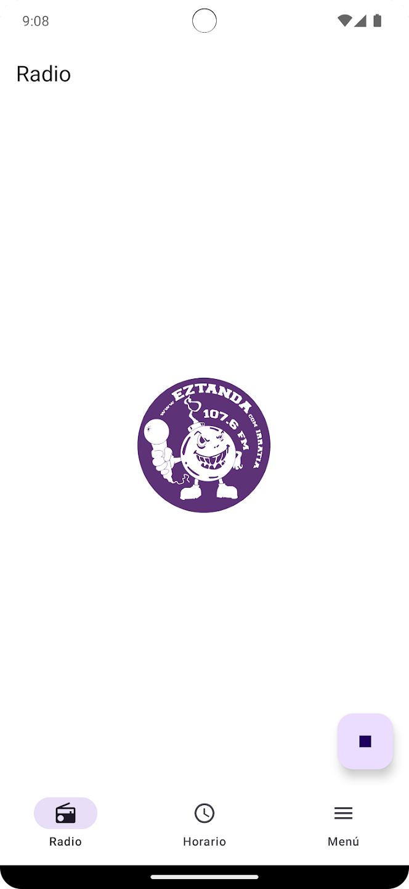 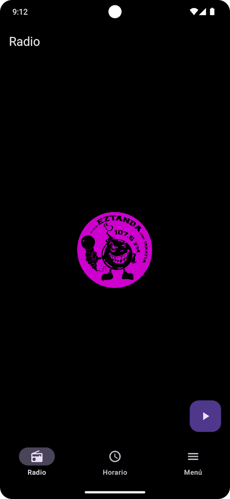

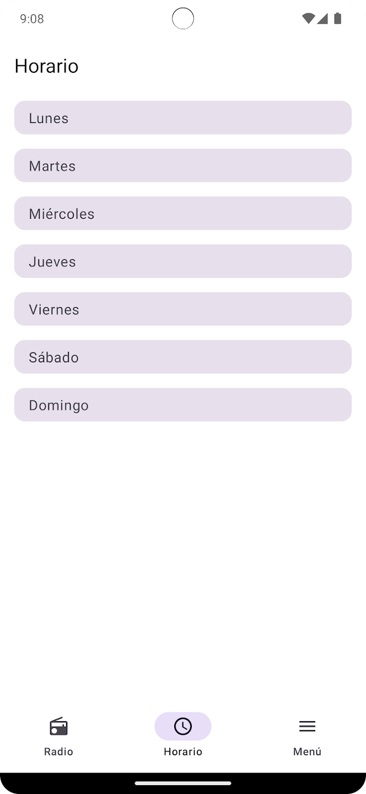 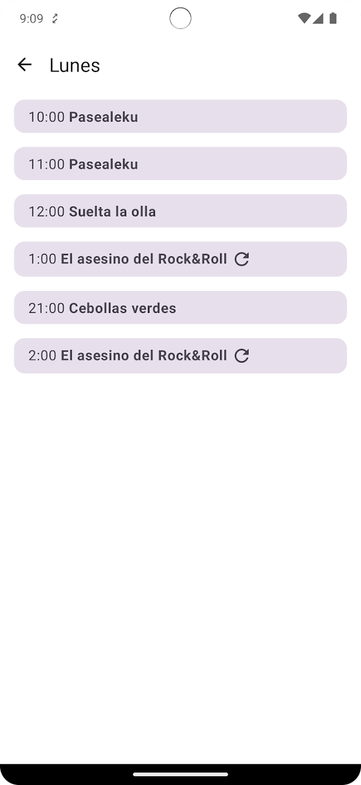 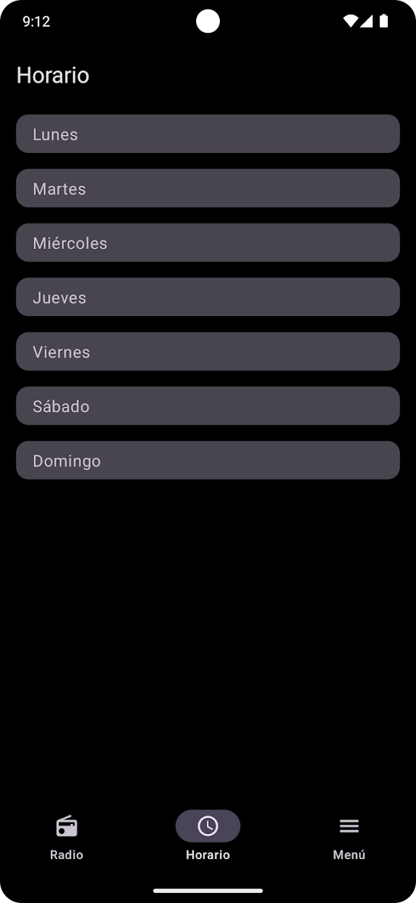 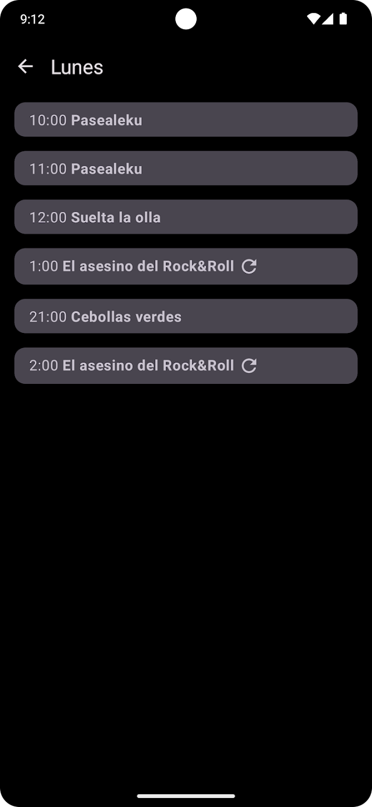

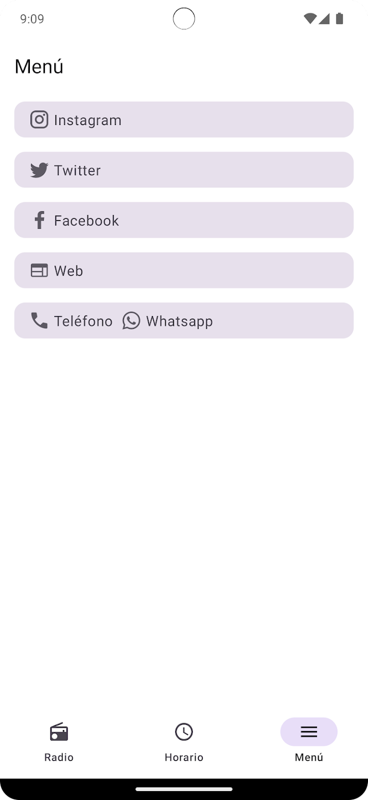 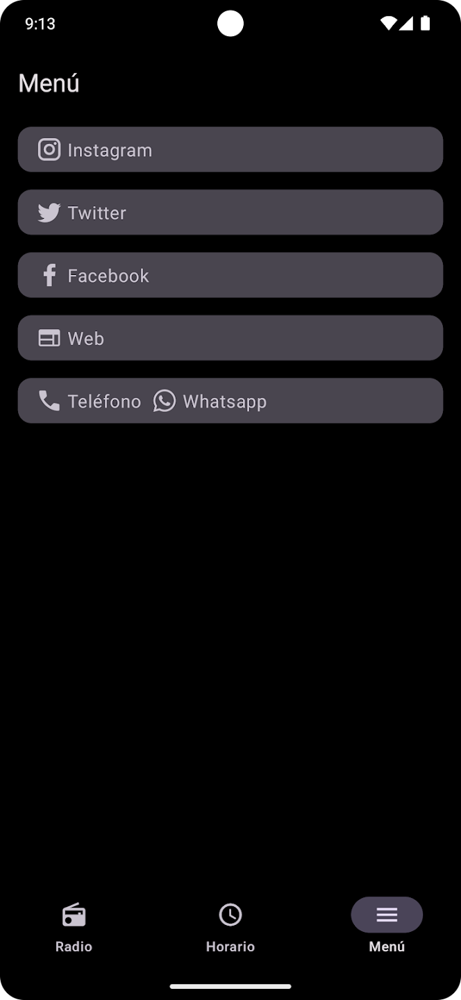

## App structure description

The app was made using Clean Architecture with MVVM-MVI pattern and reactive components with Coroutines and Flow. The app modularization was done thinking on improve the app time compilation and the fast bug detection. The modules are split in features and in CA layers as it can see in the following scheme:

## Modularization structure

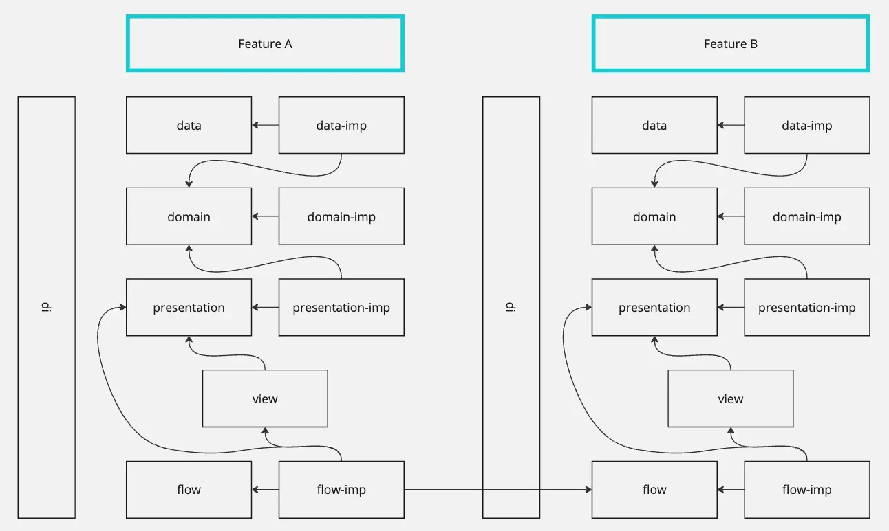

The responsibility to know the other layers, are in the -imp modules; the abstractions must not in any case be aware of other modules.

## Modules

#### Data module
Provide, send or keep the data info that the app needs to work.
I added a DataSource with the api connection to be easy to get the data, and I manage the cache inside the Repository.

#### Domain module
The business logic.
I added here the usecases fro each feature: radio, schedule and menu.

#### Presentation module
The viewModels. I created viewModels for each screen.

#### View module
The views, composable components, and the definitions of routers.

#### Flow module
The responsible to allow navigation between features and back navigation.

## Packaging
The packaging structure is based in four parts: app package path definition + feature + layer + component. For example:
com.ilizma.radio.presentation.viewmodel.

## Naming
The class naming is based in the feature division, the abstracted classes are called X.kt and the implementation classes are called XImp.kt.

## GitFlow

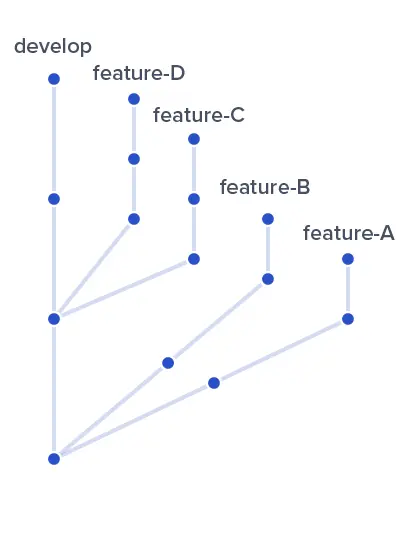 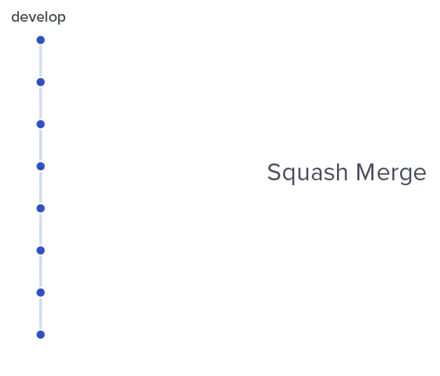

I usually use Squash and merge for features, so that they stay as a single commit in develop, and use Merge to merge develop into master, so we have a very clean git and it's much easier to follow the flow of it.
Github allows us to restore branches that have already been Squash and merged, so we don't lose the flow of commits for that feature.

### Important used libraries
- Koin: To do the dependency injection.
- Coroutines/Flow: To get/save data asynchronously.
- Buildkonfig: To create fields.
- NavigationComponent: To navigate between views.
- Ktorfit, okhttp and darwin: To manage network.
- Serialization: To manage Json.
- Chucker: To see the network in a separated screen.
- CustomActivityOnCrash: To see Android crashes easily in a new screen.
- Compose ui test and runComposeUiTest: To do the instrumentation tests.
- Mockk: A Kotlin library to mock the objects on Tests.
- Kotlin test: To do the unit and ui tests.

### Annotation
This project contains Unit Test for all classes, and Composable screen instrumentation tests.
